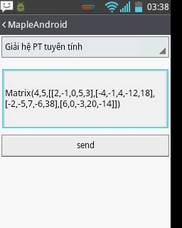

# Demo-Maple-Android---MathJax
+ Server impl by C# connect to Maple to solve problem  
+ Android connect to server, request problem and show content response by MathJax. 
 
<table>
  <tr>
    <td></td>
    <td></td>
    <td></td>
  </tr>
</table>
<table>
  <tr>
    <td></td>
    <td></td>
  </tr>
</table>
 
Android <-> Server (by C#) <->Maple
