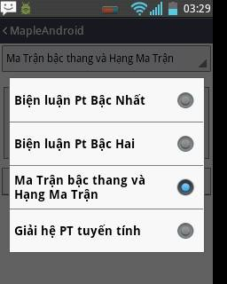
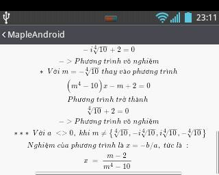

# Demo-Maple-Android---MathJax
+ Server impl by C# connect to Maple to solve problem  
+ Android connect to server, request problem and show content response by MathJax. 
 

 
Android <-> Server (by C#) <->Maple
